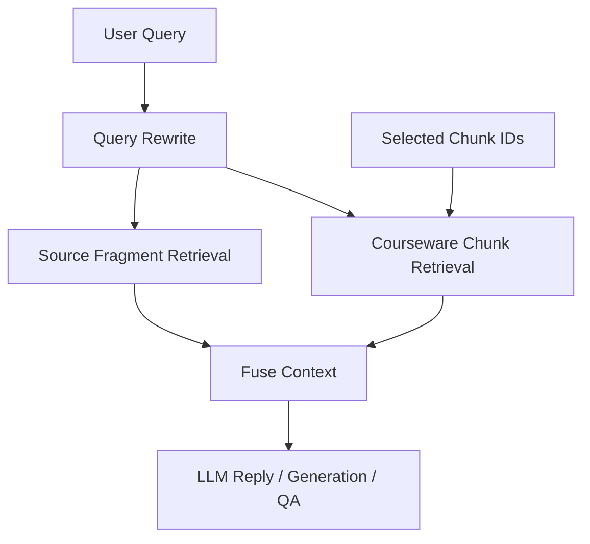

# RAG 实施工作报告（历史 + 当前状态）

**初始版本日期**：2025-03-06  
**当前修订日期**：2026-03-07  
**状态**：已落地并持续演进

---

## 1. 文档定位

这份文档最初用于记录 Ariadne 的 RAG v1.0 落地。  
现在系统已经明显超出当时范围，因此本文保留“历史起点”说明，同时补充 **当前真实实现**。

本文不再把“只基于上传文件的单路 RAG”当成现状。

---

## 2. v1.0 历史起点

最早落地的能力包括：

1. Embedding 客户端
2. 向量存储
3. 文本切分器
4. `RAGService`
5. 生成阶段接入 `asset_ids`

当时的主要目标是：
- 让课件生成可以参考用户上传文件
- 将上传文件切片后写入本地向量库存储

---

## 3. 当前状态概览

当前 Ariadne 的检索链已经升级为：

### 3.1 双路检索

1. `courseware chunks`
2. `source fragments`

这意味着 chat 不再只查源文件，也会查当前课件自己的 chunk。

### 3.2 Query Rewrite

当前检索前会做一层 query rewrite，用于：
- 短问题扩展
- 指代问题补全
- 中文问句关键词提取

### 3.3 关键词检索

当前不是只做向量检索。  
对于 fragment 还会做本地关键词检索，适合处理：
- 人名
- 项目名
- 编号
- 文件名
- 短专有词

### 3.4 Selected Chunk 语义调整

当前 `selected chunks` 的语义是：
- 软优先级
- 检索加权信号

而不是：
- 硬绑定上下文
- 只和 selected 的内容对话

这解决了“用户忘记取消 selected 但已经切换话题”的问题。

---

## 4. 当前 RAG 架构



### 4.1 生成阶段

当前生成链路的 RAG 使用位置：

1. **Outline 阶段**
   - 先用 topic 对上传资料做检索
   - 再把检索结果注入 `outline_layer`

2. **Chunk 生成阶段**
   - 对每个 chunk 再做检索
   - 把检索结果注入 `explain_layer`

### 4.2 Chat 阶段

当前 chat 会同时检索：

1. 当前课件 chunks
2. 当前课件绑定的 source assets

这意味着：
- 不选 chunk，也能问“第 1 章第 2 个 chunk 在讲什么”
- 选了 chunk，只会提高相关 chunk 的命中权重

### 4.3 QA 阶段

chunk QA 现在也会使用：
- 当前 chunk 内容
- source fragments 检索结果

---

## 5. 切块策略演进

### 5.1 v1.0

早期切块主要依赖：
- 段落边界
- 句子边界
- 固定长度

### 5.2 当前实现

当前切块已经升级为结构感知 fragment：

每个 fragment 会带：
- `heading_path`
- `block_type`
- `section_title`
- `page_no`
- `source_start`
- `source_end`

这使得：
- 调试更容易
- 关键词搜索更有依据
- 结果解释更清晰

---

## 6. 当前实现文件

### 核心代码

| 文件 | 职责 |
|------|------|
| `src/ariadne/application/query_rewrite.py` | Query rewrite 与关键词抽取 |
| `src/ariadne/application/rag_service.py` | 向量检索 + 关键词检索 + 融合 |
| `src/ariadne/application/text_splitter.py` | 结构感知切块 |
| `src/ariadne/infrastructure/vector_store.py` | 本地向量存储 |
| `src/ariadne/application/services.py` | 生成 / chat / QA / chunk 删除等 RAG 接入 |
| `src/ariadne/infrastructure/repositories.py` | 本地文件持久化与 fragment 落盘 |

### 前端相关

| 文件 | 职责 |
|------|------|
| `frontend/templates/courseware_shell.html` | 课件聊天、selected chunk、chunk 删除、局部同步 |

---

## 7. 当前持久化形态

当前 RAG 相关数据不依赖数据库，而是本地文件持久化：

```text
storage/
  assets/
    as_xxx/
      meta.json
      source.pdf
      fragments.json
  coursewares/
    cw_xxx/
      meta.json
      chunks/
      chats/
      snapshots/
```

其中：
- `fragments.json` 是关键词检索和调试的重要输入
- 向量数据由向量库存储
- chat / chunk / snapshot 也都已经文件化

---

## 8. 当前解决的问题

相比最早版本，当前实现已经解决了这些关键问题：

1. **生成阶段不再只靠模型裸写大纲**
   - outline 也接入了检索

2. **chat 不再只检索 source files**
   - 也会检索 `courseware chunks`

3. **selected chunk 不再是强上下文**
   - 变成软加权，避免误导回答

4. **中文短问题更容易命中**
   - 例如：`古诗讲的是什么`

5. **专有名词召回更稳**
   - 通过关键词检索增强

---

## 9. 当前已知边界

1. 排序权重仍有调优空间  
   特别是：
   - 标题精确匹配
   - 中文短词 vs 长词
   - selected boost 的权重

2. 切块质量仍然依赖原始文档结构  
   PDF / OCR 质量差时，fragment 质量会受影响

3. 旧资产如果来自旧切块版本，可能需要重建索引  
   否则新旧 fragment 结构会混用

---

## 10. 当前建议

### 短期

1. 持续调优 chunk 检索排序权重
2. 为检索命中增加更可观测的 debug 输出
3. 为重建索引提供显式命令或工具

### 中期

1. 让 courseware chunk retrieval 支持更强的语义匹配
2. 统一 selected chunk、引用卡片、chunk delete 后的元数据稳定性

### 长期

1. 视需要决定是否演进到更复杂的索引层
2. 仅在本地文件索引不足时，再考虑数据库或独立检索服务

---

## 11. 总结

这份报告最重要的结论是：

**Ariadne 当前的 RAG 已经不是“用户上传文件 -> 向量检索 -> 生成”这么简单。**

当前真实实现是：

1. 生成阶段接入检索
2. chat 阶段接入 `courseware chunks + source fragments` 双路检索
3. selected chunk 只做软优先级
4. fragment 已经结构化
5. 所有关键状态都以本地文件为主进行持久化

因此，这份文档应理解为：

- 记录 v1.0 的起点
- 同时明确当前系统已经演进到混合检索与本地文件持久化的更完整形态
