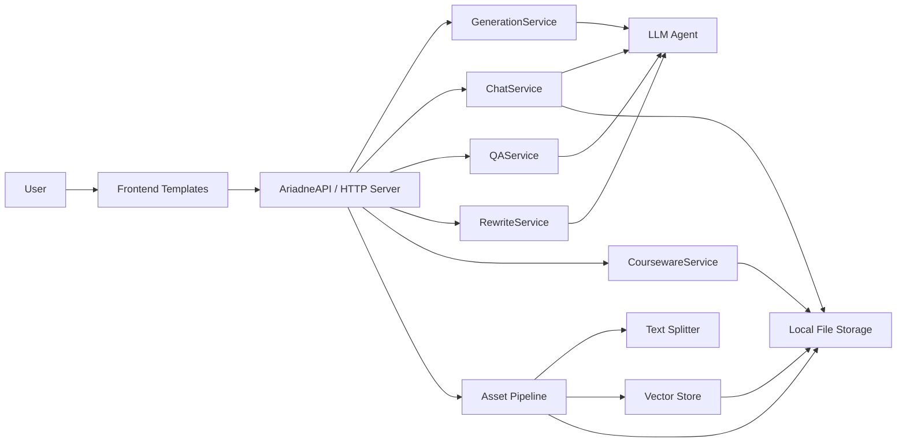
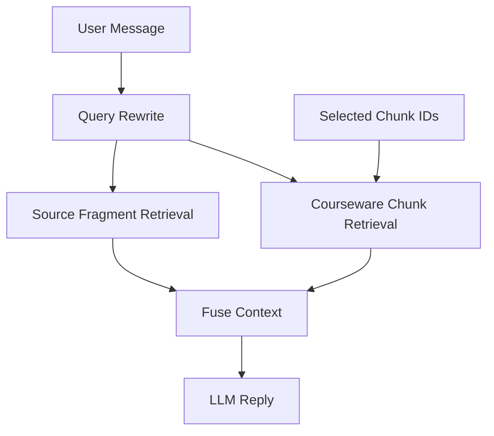
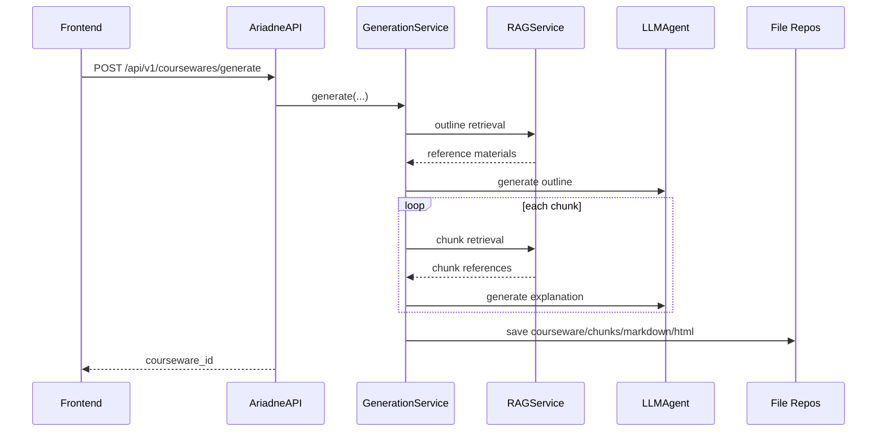
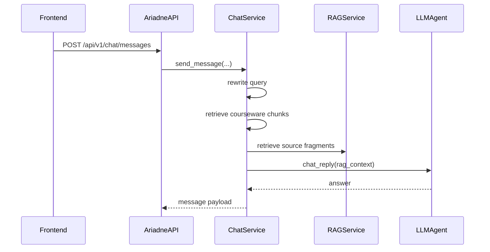
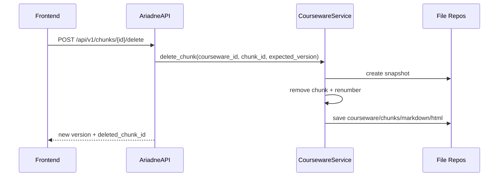

# Ariadne 架构文档

## 1. 文档目的

本文描述 **当前已经落地并运行的 Ariadne 架构**，优先反映真实代码和本地运行形态，不把未来可能演进的多服务方案当成现状。

当前系统的核心闭环是：

1. 上传资料
2. 解析与切块
3. 生成课件结构与讲解
4. 页面内学习、聊天、AI 编辑
5. 导出 HTML 课件
6. 本地文件持久化与版本回滚

---

## 2. 当前架构总览

### 2.1 单机架构



### 2.2 当前技术形态

- 前端：服务端模板 + 浏览器端原生 JS
- 后端：Python 单进程 HTTP 服务
- 主持久化：本地文件系统
- 检索：本地向量库 + 本地 fragment 关键词检索
- 生成：分层 Prompt + LLM

当前 **不使用数据库作为主存储**。  
主真相来源是文件系统中的 `storage/` 目录。

---

## 3. 核心模块

### 3.1 生成链路

入口：
- `POST /api/v1/coursewares/generate`

核心职责：
- 读取 topic / keywords / asset_ids
- 对上传资料做 outline 级检索
- 生成章节和 chunk 结构
- 按 chunk 继续检索并生成讲解内容
- 持久化 courseware、chunks、markdown、html、pages、snapshots

关键实现：
- `outline_layer.md`：只生成课程结构
- `explain_layer.md`：只生成单个 chunk 的讲解
- `generate_layer.md`：提供渲染默认配置

### 3.2 Chat / RAG 链路

当前 chat 不是单一路径，而是 **双路检索**：

1. `courseware chunks`
2. `source fragments`

流程：



关键点：
- `selected chunks` 只做软优先级，不做硬绑定
- 不选 chunk 时，也会检索课件自身的 chunks
- 选中的 chunk 不会强制覆盖其它检索结果

### 3.3 AI 编辑链路

已支持：
- 生成 rewrite draft
- 应用 draft
- undo 最近修改
- 删除 chunk

特点：
- 变更前创建 snapshot
- 采用 `expected_version` 做乐观锁
- 前端默认走局部更新，不刷新整页

### 3.4 资料解析链路

入口：
- `POST /api/v1/assets/upload`

流程：
1. 保存原始文件
2. 解析文本
3. 结构感知切块
4. 写入 `fragments.json`
5. 写入向量库

切块已经不再是纯字数切片，fragment 现在包含：
- `heading_path`
- `block_type`
- `section_title`
- `page_no`
- `source_start`
- `source_end`

---

## 4. 文件持久化架构

### 4.1 总体原则

- 一个 `courseware` 一个目录
- 一个 `chunk` 一个 JSON
- 一个 `chat session` 一个 JSON
- 一个 `asset` 一个目录
- 全局只保留轻量索引

### 4.2 目录结构

```text
storage/
  assets/
    as_xxx/
      meta.json
      source.pdf
      fragments.json
  coursewares/
    cw_xxx/
      meta.json
      outline.json
      markdown.md
      html.html
      chunks/
        ck_xxx.json
      pages/
        pg_generated/
          meta.json
          html.html
        pg_knowledge_shell/
          meta.json
          html.html
      chats/
        cs_xxx.json
      snapshots/
        v001/
  indexes/
    assets.json
    coursewares.json
    chat_sessions.json
```

### 4.3 当前主真相来源

- 课件：`storage/coursewares/<id>/`
- chunk：`storage/coursewares/<id>/chunks/*.json`
- chat：`storage/coursewares/<id>/chats/*.json`
- 资产：`storage/assets/<id>/`
- 向量检索数据：向量库存储 + `fragments.json`

---

## 5. 关键数据实体

### 5.1 Courseware

核心字段：
- `id`
- `topic`
- `status`
- `current_version`
- `source_asset_ids`
- `default_page_id`
- `knowledge_markdown_path`
- `knowledge_html_path`
- `outline`

### 5.2 Chunk

核心字段：
- `id`
- `title`
- `content`
- `order_no`
- `chapter_no`
- `chunk_no`
- `page_id`
- `understand_state`
- `is_favorite`
- `collapsed`

### 5.3 ChatSession / ChatMessage

当前已持久化：
- 会话基础信息
- 消息列表
- `selected_context`
- `selected_chunk_ids`
- `asset_ids`
- `sources`

### 5.4 Asset Fragment

fragment 同时服务于：
- 向量检索
- 关键词检索
- 调试回溯

---

## 6. 关键时序

### 6.1 课件生成



### 6.2 聊天问答



### 6.3 Chunk 删除



---

## 7. 当前接口分层

### 7.1 HTTP 层

文件：
- `src/ariadne/api/http_server.py`

职责：
- 路由分发
- 参数提取
- 统一 JSON 响应

### 7.2 Facade 层

文件：
- `src/ariadne/api/facade.py`

职责：
- HTTP 请求到应用服务的参数桥接
- 统一返回结构
- 前端 payload 兼容处理

### 7.3 应用服务层

文件：
- `src/ariadne/application/services.py`

职责：
- 课件生成
- 聊天
- QA
- rewrite / apply / undo
- chunk 删除

---

## 8. 当前已知实现边界

1. 当前主运行形态是单机本地，不是多租户服务化部署
2. 持久化主通路已经文件化，但仍有少量临时状态属于运行时内存
3. `selected chunk` 已经是软优先级，但排序权重仍有持续调优空间
4. 课件删除/回滚是局部更新优先，依赖前后端元数据同步

---

## 9. 演进方向

以下是未来方向，不代表当前已经实现：

1. 将本地文件索引进一步抽象成稳定的存储接口
2. 引入更强的 chunk / fragment 排序模型
3. 将 page 元数据与阅读态交互进一步解耦
4. 如有必要，再演进到多服务或数据库方案

当前阶段不建议为了“架构好看”提前引入数据库或拆服务。  
真实优先级仍然是：

1. 保持本地单机闭环稳定
2. 保持课件、聊天、检索链一致
3. 优先优化检索质量和编辑体验
