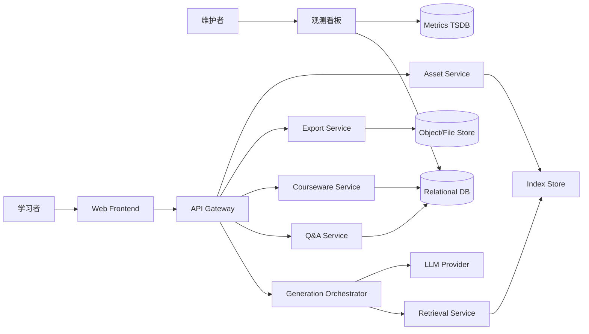
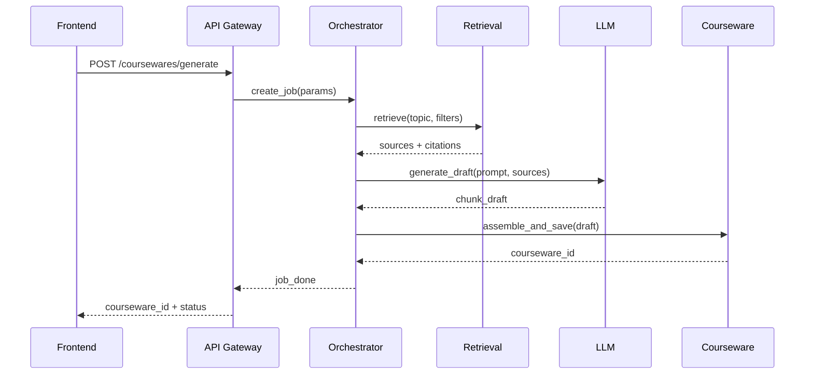
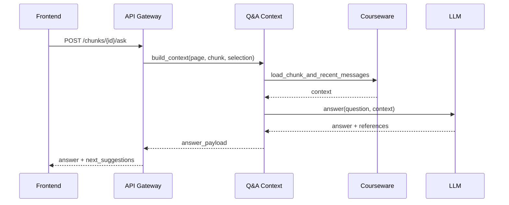
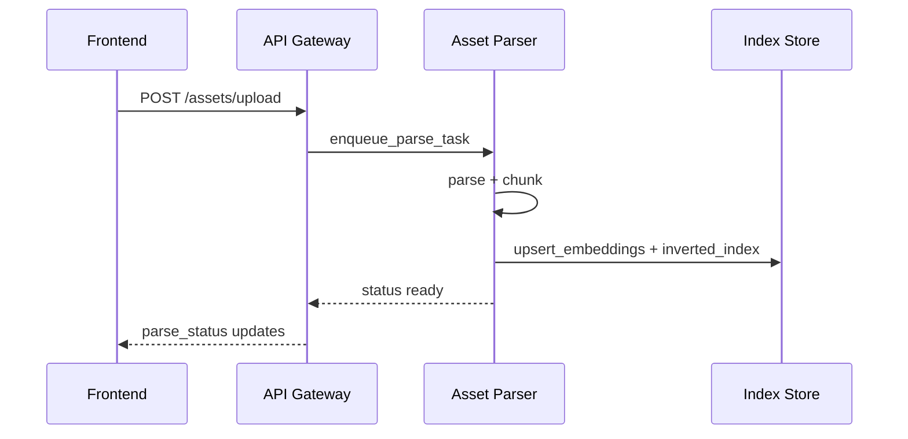

# Ariadne 架构文档（详细版，基于 user_stories_100）

## 1. 架构目标与设计原则

架构目标：
- 支撑“主题生成 + chunk 学习 + 上下文问答 + 导出离线”的核心闭环。
- 保证本地优先、可选云同步、离线可用。
- 支持从单机 MVP 演进到多端协同。

设计原则：
- 领域解耦：生成、检索、问答、版本、导出独立服务边界。
- 本地优先：核心能力不依赖登录与远程账号系统。
- 可观测优先：每条主链路可追踪、可定位、可回放。
- 失败可恢复：任务幂等、版本可回滚、导出可重试。

## 2. 架构视图

## 2.1 上下文视图（Context）


## 2.2 容器视图（Container）
- `frontend-web`：React/TS，负责 UI、状态管理、离线缓存、SSE 客户端。
- `api-gateway`：统一入口，负责鉴权、限流、参数校验、trace_id。
- `orchestrator`：生成作业编排与阶段事件。
- `retrieval`：多源检索、来源过滤、可信度评分。
- `qa-context`：上下文拼装、多轮会话、补充建议。
- `courseware`：课件/chunk/版本/标签管理。
- `asset-parser`：文档解析、切片、索引写入。
- `exporter`：HTML/ZIP/只读包输出。
- `observability`：日志聚合、指标计算、错误趋势。

## 2.3 组件视图（Component，按服务）

`orchestrator` 内部组件：
- `job-manager`：创建任务、幂等检查、重试计数。
- `phase-runner`：检索、生成、组装三阶段执行器。
- `event-publisher`：进度事件发布（SSE/WS）。
- `result-assembler`：结构修复、章节排序、chunk 编号。

`retrieval` 内部组件：
- `source-router`：网络/本地/历史知识路由。
- `filter-engine`：白名单、黑名单、站点限定过滤。
- `rank-engine`：来源偏好权重 + 可信度融合排序。
- `citation-builder`：来源摘要构建与去重。

`qa-context` 内部组件：
- `context-loader`：读取 page/chunk/selection 语境。
- `window-manager`：多轮上下文窗口裁剪。
- `answer-generator`：简版/深入版回答。
- `action-planner`：补充到 chunk、生成关联 chunk 的动作提议。

## 3. 关键时序流程

## 3.1 课件生成时序


## 3.2 chunk 问答时序


## 3.3 上传解析时序


## 4. 状态机设计

## 4.1 生成任务状态机
- 状态：`queued`、`retrieving`、`generating`、`assembling`、`done`、`failed`。
- 转移：
- `queued -> retrieving`：任务开始。
- `retrieving -> generating`：检索完成。
- `generating -> assembling`：草稿生成完成。
- `assembling -> done`：课件落库成功。
- 任意状态 -> `failed`：不可恢复错误。
- `failed -> queued`：用户重试（retry_count + 1）。

## 4.2 资料解析状态机
- 状态：`queued`、`processing`、`ready`、`failed`。
- 失败分类：`unsupported_format`、`parse_error`、`index_error`。

## 4.3 AI 编辑草稿状态机
- 状态：`drafted`、`previewed`、`applied`、`rejected`、`reverted`。
- 约束：未 `applied` 之前不得写入正文版本。

## 5. 数据架构

## 5.1 逻辑数据域
- 课件域：课件、章节、chunk、标签、版本。
- 对话域：会话、消息、上下文快照、动作记录。
- 检索域：来源、引用、检索任务、索引分片。
- 用户域：学习画像、偏好、本地模式、掌握度。
- 运维域：事件日志、错误日志、性能指标。

## 5.2 关系模型（核心）
```text
coursewares 1---n chunks
chunks 1---n chunk_versions
chunks n---m sources (via chunk_sources)
coursewares 1---n chat_sessions
chat_sessions 1---n chat_messages
assets 1---n asset_segments
profiles 1---n profile_memories
```

## 5.3 关键索引
- `chunks(courseware_id, order_no)`：目录加载和跳转。
- `chat_messages(session_id, created_at desc)`：多轮上下文读取。
- `chunk_sources(chunk_id)`：来源展开。
- `event_logs(event_type, created_at desc)`：日志筛选。
- `metrics_ts(metric_name, ts)`：趋势查询。

## 5.4 一致性策略
- 课件编辑：事务内写 `chunks + chunk_versions + event_logs`。
- 导出任务：读取固定版本快照，避免导出中数据漂移。
- 撤销操作：基于 `current_version` 乐观锁，冲突则提示刷新。

## 6. 接口架构规范

## 6.1 API 分层
- 同步 API：查询与轻量写操作（REST）。
- 异步 API：生成、解析、导出等长任务（任务 ID + 轮询或 SSE）。
- 内部 RPC：服务间调用（可 HTTP/gRPC）。

## 6.2 统一错误模型
```json
{
  "code": "GENERATION_TIMEOUT",
  "message": "generation phase timeout",
  "trace_id": "tr_001",
  "retryable": true,
  "details": {"phase": "generating"}
}
```

## 6.3 幂等与重放
- 生成和导出接口要求 `Idempotency-Key`。
- 重放请求返回已存在任务，避免重复占用资源。

## 7. 检索与生成融合策略

召回策略：
- 第一层：关键词倒排召回（高精确）。
- 第二层：向量语义召回（高召回）。
- 第三层：历史课件与笔记召回（个性化）。

融合排序：
- 总分 `S = α*semantic + β*keyword + γ*credibility + δ*preference`。
- 默认参数：`α=0.35, β=0.25, γ=0.25, δ=0.15`。

去重策略：
- URL 级去重。
- 标题 + 摘要 simhash 去重。

## 8. 安全与隐私架构

## 8.1 数据分级
- P0 数据：课件正文、笔记、聊天记录（默认本地存储）。
- P1 数据：日志与指标（匿名化后可上报）。
- P2 数据：可选云同步数据（用户显式开启）。

## 8.2 隐私约束
- 本地模式启用时，不发送 profile/memory 到远端。
- 上传文件仅用于当前用户知识库索引。
- 导出包默认不包含隐私日志。

## 8.3 安全控制
- 上传文件类型白名单与大小限制。
- 接口限流与防抖。
- 输出内容安全过滤（脚本注入、危险链接）。

## 9. 可观测性架构

## 9.1 日志
- 接入结构化日志：`trace_id, span_id, service, event, cost_ms, status`。
- 关键操作日志：生成、问答、补充、导出、回滚。

## 9.2 指标
- RED 指标：Rate、Errors、Duration。
- 业务指标：生成成功率、问答命中率、导出成功率、离线命中率。

## 9.3 链路追踪
- Gateway -> Orchestrator -> Retrieval/LLM -> Courseware 全链路 trace。
- 每次失败可定位到阶段与外部依赖。

## 10. 性能与容量规划

## 10.1 性能预算（P1）
- 生成首屏：<= 15s（P50），<= 22s（P95）。
- chunk 跳转：<= 1s。
- 问答：<= 5s（P95）。

## 10.2 容量估算（单租户初期）
- 日活 1k，日生成 5k 次，平均每课件 12 chunk。
- 每日新增 chunk 约 6 万。
- 文档上传日均 2k 份，平均 1MB。

## 10.3 扩展路径
- 本地单实例 -> 多实例 API + 独立任务队列 -> 检索与生成拆分扩容。

## 11. 高可用与灾备

高可用策略：
- 生成任务落队列，worker 可水平扩展。
- 外部 LLM 失败时可降级到简版模板输出。

灾备策略：
- 版本快照定期备份。
- 指标与日志分开存储。
- 导出文件可重建，不作为唯一数据源。

## 12. 部署架构（建议）

环境分层：
- `dev`：开发联调。
- `staging`：预发布与回归压测。
- `prod`：生产。

部署单元：
- 前端静态托管。
- 网关与服务容器化部署。
- DB 与索引服务独立持久化存储。

## 13. Story 与架构组件映射
- E1/E4 -> `orchestrator + retrieval + asset-parser`
- E2/E3/E7 -> `frontend + qa-context + courseware`
- E9 -> `exporter + courseware`
- E10 -> `observability + gateway + qa automation`
- E5/E8/E6 -> `profile + graph/review subdomain`

## 14. 技术债与演进计划
- 短期债：先用单库承载业务与日志，后续拆分时序库。
- 中期债：检索分数融合参数需在线调优系统。
- 长期债：跨设备同步冲突解决（CRDT/OT 方案评估）。

## 15. 架构决策记录（ADR）模板
每个关键决策至少记录：
- 问题背景。
- 备选方案。
- 决策结论。
- 影响范围。
- 回滚方案。

建议首批 ADR：
- ADR-001：本地优先 + 可选云同步。
- ADR-002：SSE 作为进度推送首选。
- ADR-003：检索融合公式与可信度分级策略。
- ADR-004：版本快照与撤销机制。

